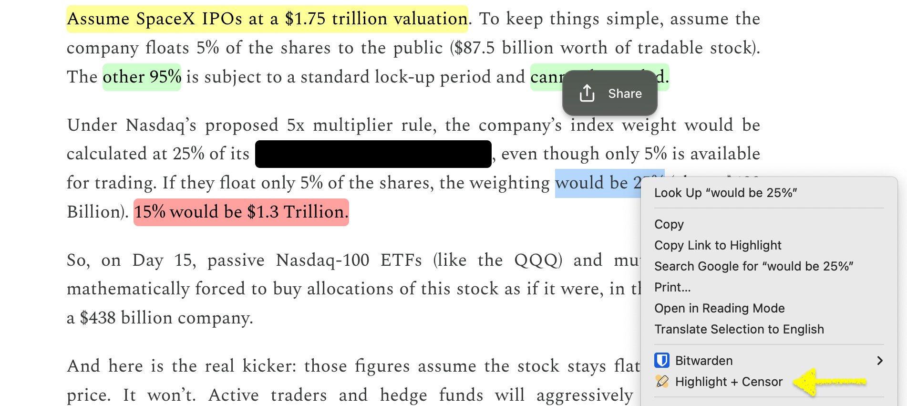

<h2 align="center">Highlight + Censor</h2>

Straightforward: Highlight + Censor. Use it as guides or to hide details. 

Available on both Chrome & Firefox Extension store
- Chrome: https://chromewebstore.google.com/detail/highlight-+-censor/leofdnpplaccgbcpgkpdeedbdmcpnpih?utm_source=item-share-cb
- Firefox: https://addons.mozilla.org/en-US/firefox/addon/highlight-censor/

Features: Highlight and censor important text or images
- Select the text or image
- Right-click
- Choose “Highlight + Censor” from the menu

Privacy-focused
- No data collection
- All highlights and censors are temporary
- Reloading or closing the page removes everything

License: MIT
